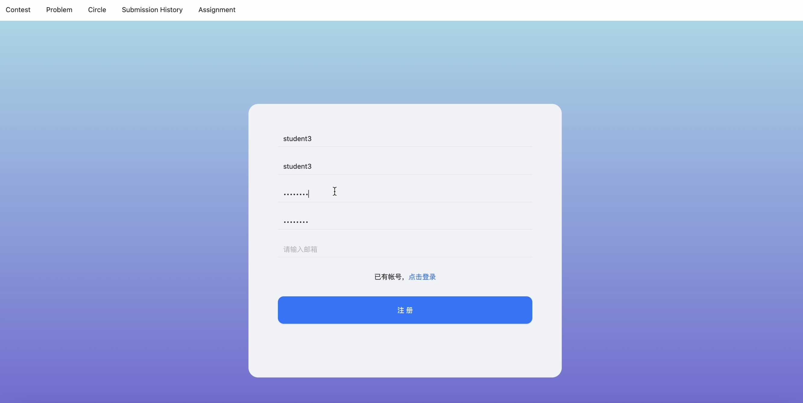
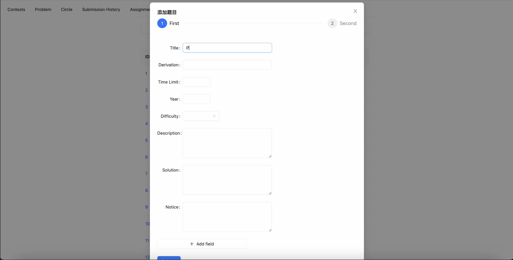
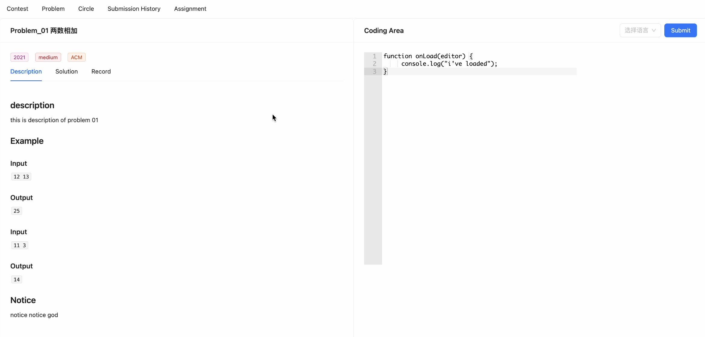
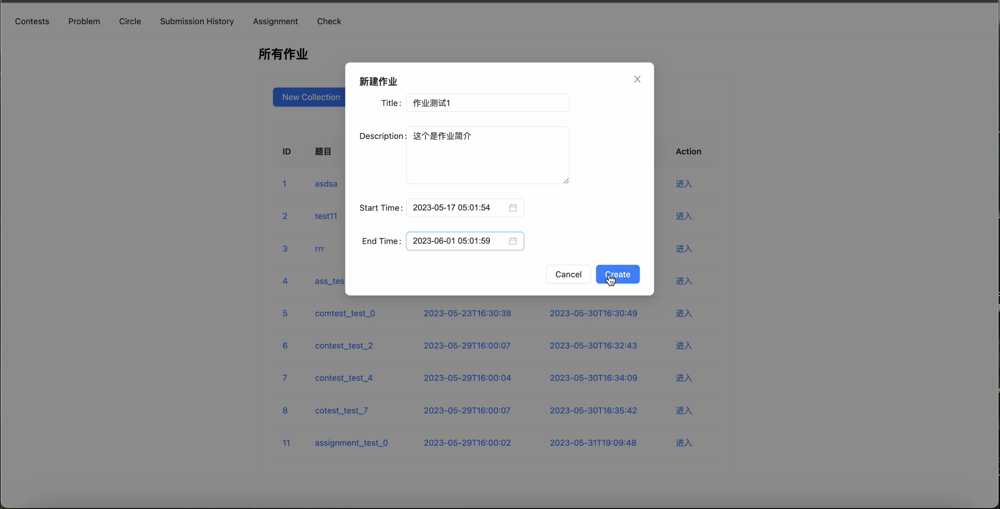
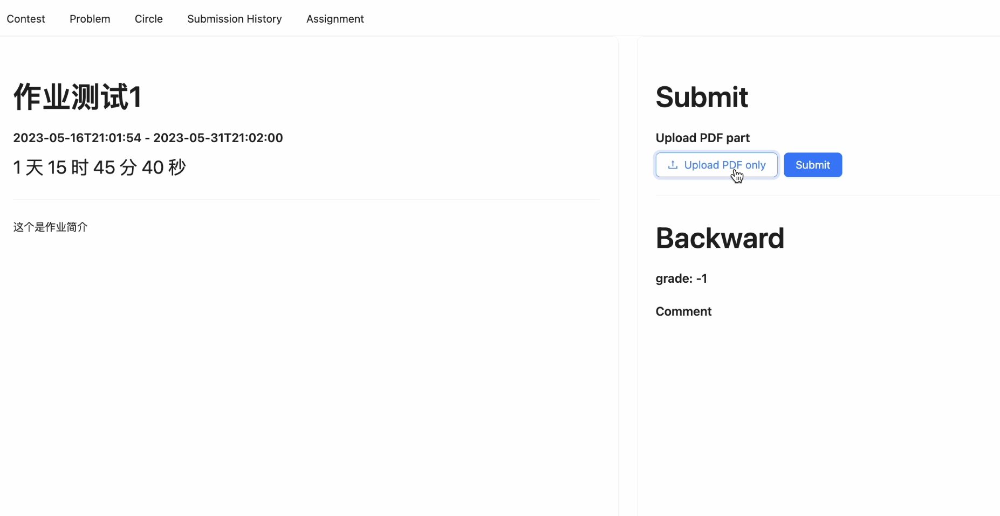
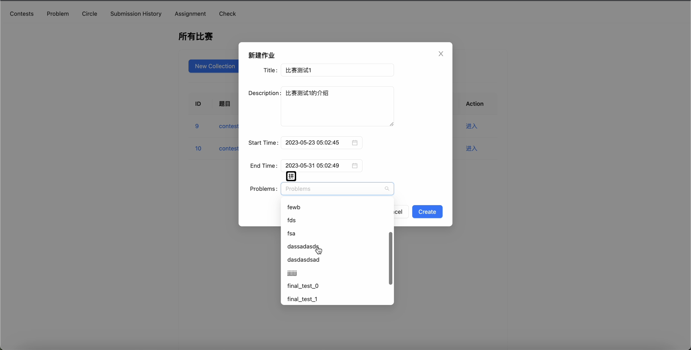
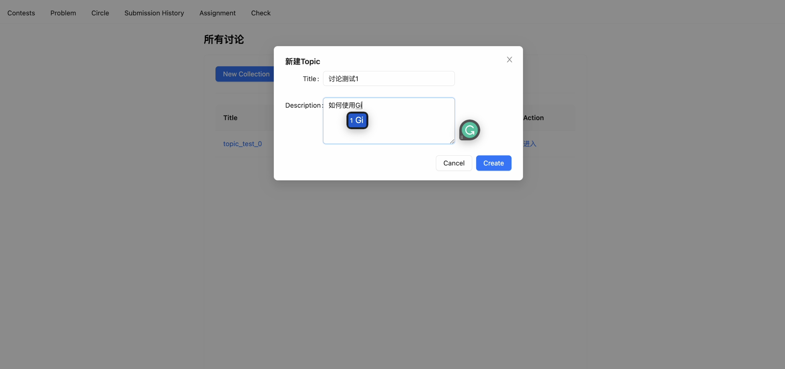
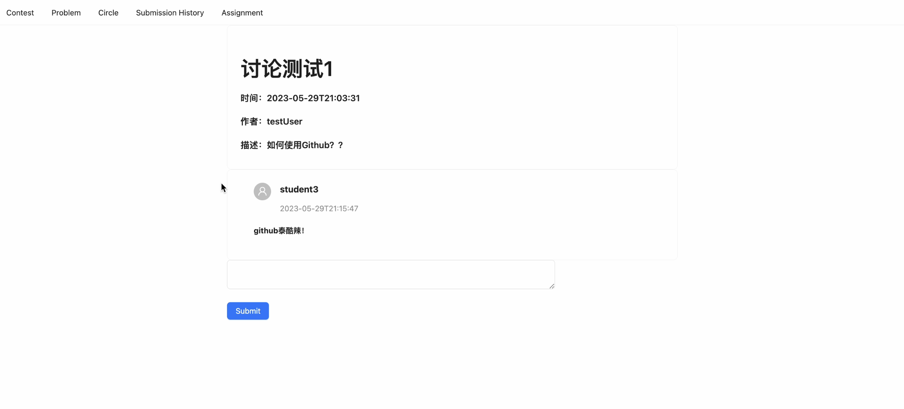

# Readme

### for end users

You can visit the OJ site on 

https://oj-front.vercel.app/login

Features on this OJ site:




**PROBLEM**: Problem Banks, Problem Creating, Problem Reading, Problem Judging






**ASSIGNMENT**: Assignment Banks, Assignment Creating, Assignment Reading, Assignment Judging





**CONTEST**: Contest Banks, Contest Creating, Contest Taking




**CIRCLE**: Discuss Board






**CHECK**: For teacher to check the assignment


**SUBMISSION**: All submission record

## for developers

To start the project on your local side:

```
git clone https://github.com/AWREDD/oj-front.git
npm install -g pnpm
pnpm install
umi start
```

The project strcuture:

```
-src
	-assets
	-components
	-layouts
	-models
	-pages
		-assigment
		-check
		-circle
		-contest
		-history
		-login
		404.tsx
		index.tsx
```

We use Umi.js, react, typescript, ant desgin to build this site. You can refer umi.js https://umijs.org/docs/introduce/introduce to quickly learn the structure of this project and it is very easy to hand on.

The Router is conventional routing, so you don't need to add route config. And any illegal url can automatically jump to 404.tsx.

